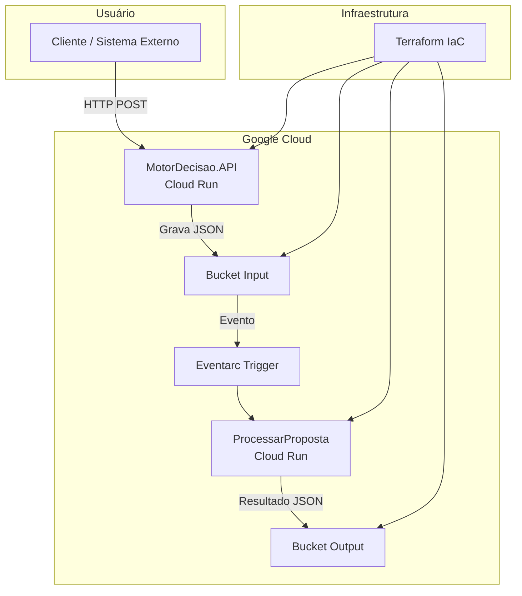

````markdown
# 🧠 MotorDecisaoSolution  
> Sistema de Motor de Decisão de Crédito em nuvem com infraestrutura como código e execução serverless na Google Cloud Platform (GCP).


---

## 📘 Visão Geral  

O **MotorDecisaoSolution** implementa uma arquitetura *cloud-native* para processamento automatizado de propostas de crédito.  
O sistema é composto por uma **API** e uma **função de processamento** desacopladas, que se comunicam por meio de **eventos em buckets de armazenamento (GCS)**.  

A infraestrutura é totalmente gerenciada via **Terraform**, permitindo reprodutibilidade, versionamento e fácil manutenção.

---

## 🧩 Arquitetura da Solução  

```mermaid
flowchart TD
    A[Usuário / Sistema Cliente] -->|POST /propostas| B[API - MotorDecisao.API]
    B -->|Grava JSON| C[Bucket Input (GCS)]
    C -->|Evento de novo arquivo| D[Eventarc Trigger]
    D --> E[Função ProcessarProposta (Cloud Run)]
    E -->|Resultado| F[Bucket Output (GCS)]
    F -->|Disponibiliza Decisão| G[Consulta ou Integração Externa]
````

**Fluxo resumido:**

1. A API recebe propostas de crédito e grava o JSON em um bucket de entrada.
2. O *Eventarc* detecta o novo arquivo e aciona o serviço de processamento.
3. O serviço executa regras de decisão e grava o resultado em outro bucket.
4. Os resultados ficam disponíveis para análise ou integração com outros sistemas.

---

## 🛠️ Tecnologias e Ferramentas

| Camada              | Tecnologia / Serviço      | Descrição                                   |
| ------------------- | ------------------------- | ------------------------------------------- |
| **Aplicação**       | C# (.NET 8)               | Lógica da API e do processador de decisão   |
| **Containerização** | Docker                    | Empacotamento das aplicações para Cloud Run |
| **Infraestrutura**  | Terraform                 | Provisionamento de recursos GCP (IaC)       |
| **Nuvem**           | Google Cloud Platform     | Cloud Run, Storage, IAM, Eventarc           |
| **Build/Deploy**    | Google Cloud SDK (gcloud) | Deploy automatizado das imagens             |
| **Observabilidade** | Stackdriver / Logs GCP    | Monitoramento e logs centralizados          |

---

## 🧱 Estrutura do Projeto

```
MotorDecisaoSolution/
├── MotorDecisao.API/            # API pública (recebe propostas)
│   ├── Controllers/
│   ├── Program.cs
│   ├── appsettings.json
│   └── Dockerfile
│
├── ProcessarProposta/           # Função de decisão (processa JSONs)
│   ├── Services/
│   ├── Program.cs
│   ├── appsettings.json
│   └── Dockerfile
│
├── terraform/                   # Infraestrutura como código (GCP)
│   ├── main.tf
│   ├── variables.tf
│   ├── cloud_run.tf
│   ├── eventarc.tf
│   ├── buckets.tf
│   ├── iam.tf
│   └── outputs.tf
│
└── README.md
```

---

## ⚙️ Pré-Requisitos

Antes de iniciar, garanta que você possui:

* ✅ [.NET 8 SDK](https://dotnet.microsoft.com/download)
* ✅ [Terraform ≥ 1.8.0](https://developer.hashicorp.com/terraform/downloads)
* ✅ [Google Cloud SDK (gcloud)](https://cloud.google.com/sdk/docs/install)
* ✅ [Docker](https://www.docker.com/get-started)
* ✅ Projeto ativo na **Google Cloud Platform** com **faturamento habilitado**
* ✅ Permissões para Cloud Run, Eventarc, IAM e Storage

---

## 🚀 Como Executar Localmente

### 1. Clone o repositório

```bash
git clone https://github.com/thiagodsantana/MotorDecisaoSolution.git
cd MotorDecisaoSolution
```

### 2. Compile os projetos

```bash
dotnet build
```

### 3. Execute a API localmente

```bash
cd MotorDecisao.API
dotnet run
```

A API estará disponível em: `https://localhost:5001`

---

## ☁️ Deploy na GCP

### 1. Configure o Terraform

```bash
cd terraform
terraform init
terraform plan
terraform apply -auto-approve
```

Isso criará:

* Buckets de entrada/saída
* Contas de serviço e permissões
* Serviços Cloud Run
* Trigger Eventarc

### 2. Deploy da API

```bash
cd ../MotorDecisao.API
gcloud builds submit --tag gcr.io/<PROJECT_ID>/motor-decisao-api:1.0 .
gcloud run deploy motor-decisao-api \
  --image gcr.io/<PROJECT_ID>/motor-decisao-api:1.0 \
  --region <REGION> \
  --platform managed \
  --allow-unauthenticated \
  --set-env-vars BucketInput=<BUCKET_INPUT>,BucketOutput=<BUCKET_OUTPUT>
```

### 3. Deploy do Processador

```bash
cd ../ProcessarProposta
gcloud builds submit --tag gcr.io/<PROJECT_ID>/motor-decisao-function:1.0 .
gcloud run deploy motor-decisao-function \
  --image gcr.io/<PROJECT_ID>/motor-decisao-function:1.0 \
  --region <REGION> \
  --platform managed \
  --no-allow-unauthenticated \
  --set-env-vars BucketOutput=<BUCKET_OUTPUT>
```

---

## 🧪 Testando a Solução

Envie uma proposta para a API:

```bash
curl -X POST https://<API_URL>/propostas \
-H "Content-Type: application/json" \
-d '{
  "nome": "João Silva",
  "cpf": "12345678900",
  "rendaMensal": 4500,
  "idade": 33,
  "email": "joao@example.com"
}'
```

✅ O arquivo será gravado no bucket de **input**.
⚙️ O *Eventarc* acionará o serviço de processamento.
📦 O resultado aparecerá no bucket de **output**.

---

## 🧮 Diagrama de Componentes



---

## 📚 Boas Práticas e Recomendações

* **Versionamento Semântico:** use tags `v1.0.0`, `v1.1.0`, etc.
* **CI/CD:** configure GitHub Actions para build e deploy automáticos.
* **Monitoramento:** utilize o Stackdriver (Cloud Logging / Monitoring).
* **Ambientes:** use workspaces Terraform (`dev`, `hml`, `prod`).
* **Segurança:** variáveis sensíveis devem ser geridas via Secret Manager.
* **Documentação:** mantenha Swagger/UI exposto apenas em ambientes internos.

---

## 🤝 Contribuindo

1. Faça um *fork* do projeto
2. Crie uma *branch*: `git checkout -b feature/minha-feature`
3. Commit suas alterações: `git commit -m "Adiciona nova feature"`
4. Envie a *branch*: `git push origin feature/minha-feature`
5. Abra um *Pull Request*

---

## 🪪 Licença

Este projeto está sob a licença **MIT** — sinta-se livre para usar, estudar e aprimorar.

---

## ✉️ Contato

**Autor:** [Thiago D. Santana](https://github.com/thiagodsantana)
**LinkedIn:** [linkedin.com/in/thiagodsantana](https://linkedin.com/in/thiagodsantana)
**E-mail:** [thiago.darley@gmail.com](mailto:thiago.darley@gmail.com)
